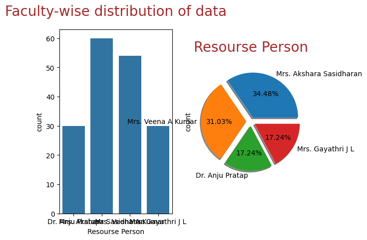
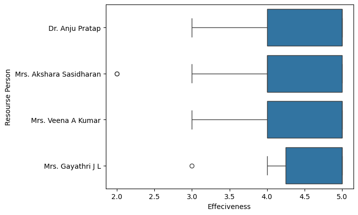
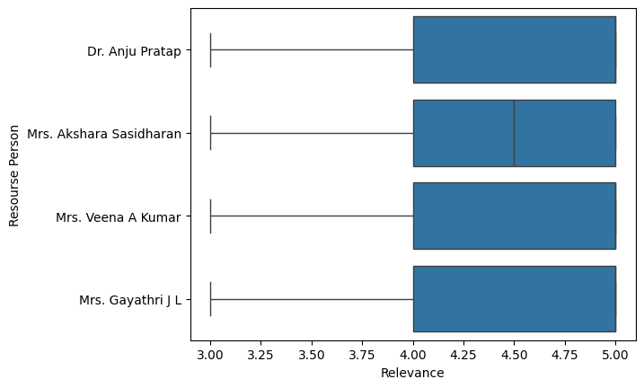
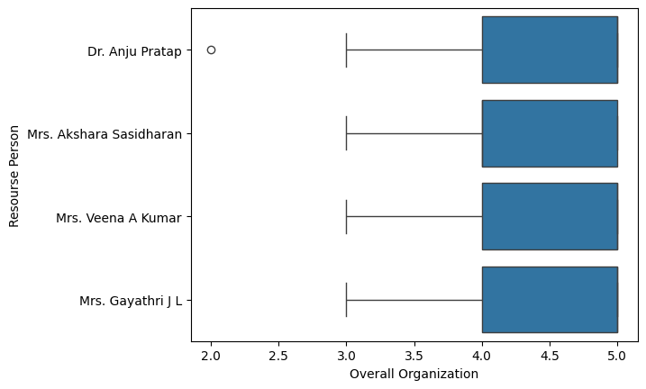
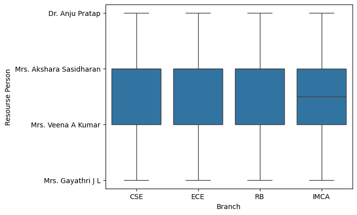
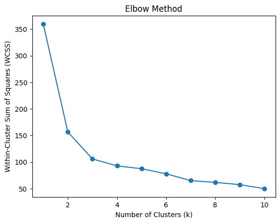
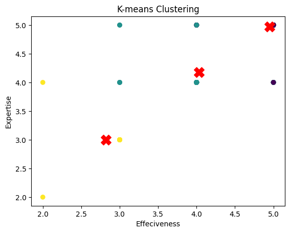

# Machine Learning Report on Feedback Data Analysis

## Table of Contents
1. [Introduction](#introduction)
2. [Problem Statement](#problem-statement)
3. [Data Overview](#data-overview)
4. [Exploratory Data Analysis (EDA)](#exploratory-data-analysis-eda)
    - [Faculty-Wise Distribution of Data](#faculty-wise-distribution-of-data)
    - [Ratings by Faculty](#ratings-by-faculty)
    - [Ratings by Branch](#ratings-by-branch)
5. [K-Means Clustering Analysis](#k-means-clustering-analysis)
    - [Elbow Method](#elbow-method)
    - [Cluster Visualization](#cluster-visualization)
6. [Observations and Recommendations](#observations-and-recommendations)
7. [Conclusion](#conclusion)

## Introduction

This report aims to analyze the segmentation of participants in Intel Certification courses based on their satisfaction levels. The analysis utilizes both exploratory data analysis (EDA) techniques and machine learning clustering methods to provide insights into participant perceptions and to tailor course content and delivery effectively.

## Problem Statement

The objective of this study is to understand how participants perceive Intel Certification courses across various metrics such as content quality, effectiveness, expertise, relevance, and overall organization. By segmenting participants based on their satisfaction levels, the report seeks to identify distinct groups with differing perceptions, enabling customized improvements to meet the diverse needs of the participants.

## Data Overview

The feedback dataset contains responses from participants, including ratings and textual feedback, on different aspects of the sessions they attended. Irrelevant fields such as timestamps and email IDs were removed during preprocessing to focus on relevant feedback.

## Exploratory Data Analysis (EDA)

### Faculty-Wise Distribution of Data

  
*Image 1: Faculty-Wise Distribution of Feedback*

The distribution of feedback entries across faculty members indicates that Mrs. Akshara Sasidharan and Mrs. Veena A Kumar received the majority of feedback, suggesting their sessions were more attended or rated by participants.

Subsequent boxplots provide a visual summary of the ratings for content quality, effectiveness, expertise, relevance, and overall organization, segmented by the resource person. The plots reveal generally high median scores across all categories, indicating positive reception. Outliers are noted in effectiveness and expertise, suggesting a few instances of divergent opinions.

### Ratings by Faculty

  
*Image 2: Content Quality Ratings by Faculty*

  
*Image 3: Effectiveness Ratings by Faculty*

  
*Image 4: Expertise Ratings by Faculty*

  
*Image 5: Relevance Ratings by Faculty*

  
*Image 6: Overall Organization Ratings by Faculty*

Boxplots displaying ratings across different aspects segmented by faculty members show generally high median scores, indicating positive reception. However, outliers suggest instances of divergent opinions, particularly in effectiveness and expertise.

### Ratings by Branch

  
*Image 7: Branch-Wise Ratings*

Branch-wise boxplots reveal consistent perceptions of content quality across different academic departments, with a few outliers suggesting variations in satisfaction levels.

## K-Means Clustering Analysis

### Elbow Method

  
*Image 8: Elbow Method Plot*

The Elbow Method plot suggests a slight bend at k=3, indicating a potentially optimal number of clusters for segmentation, although the curve is smooth, suggesting potential overlap or ambiguity in the data.

### Cluster Visualization

  
*Image 9: Cluster Visualization*

The scatter plot with centroids illustrates the formation of clusters based on effectiveness and expertise ratings. While some separation is observed, overlap suggests variations in perceptions among participants.

## Observations and Recommendations

- Future session planning should consider distributing feedback opportunities more evenly among faculty members to ensure balanced feedback.
- While overall satisfaction is high, targeted improvements are needed in areas highlighted by outliers, particularly in effectiveness and expertise.
- The lack of distinct clusters suggests the need for additional dimensions of analysis or additional data sources, such as pre- and post-session competency assessments.
- Qualitative insights from textual feedback could complement quantitative ratings, providing a more comprehensive understanding of participant experiences.

## Conclusion

The feedback data analysis reveals generally positive ratings for Intel Certification courses, with areas for improvement highlighted by outliers. The segmentation analysis offers insights into participant satisfaction levels, guiding targeted improvements to enhance the learning experience. The report provides valuable insights for future course planning, content creation, and delivery adjustments.
