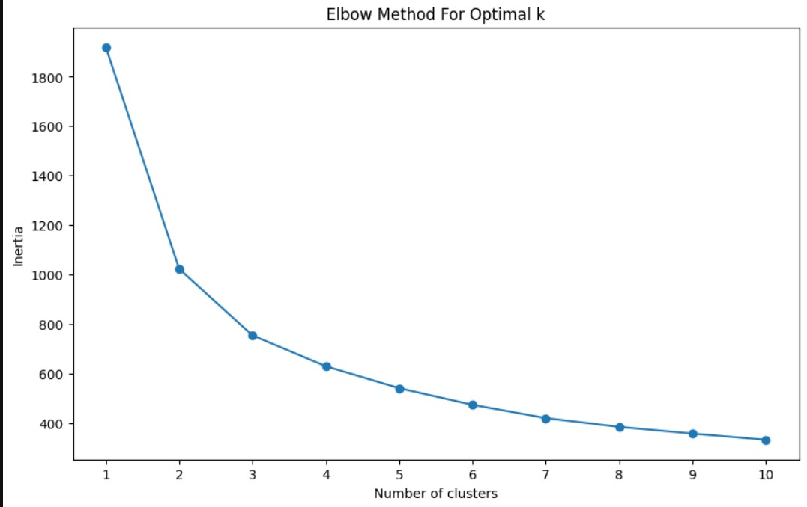
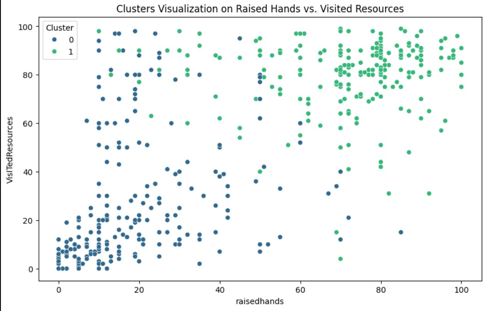

# Student Behavior Analysis

## Summary Statistics and Unique Values

### Summary Statistics for Numeric Columns

- The dataset consists of 480 entries.
- The mean number of times students raised their hands in class is approximately 46.77, with a standard deviation of 30.78.
- The average number of times students visited resources is around 54.80, with a standard deviation of 33.08.
- Announcements view averages at 37.92, with a standard deviation of 26.61.
- Discussion participation averages at 43.28, with a standard deviation of 27.64.
- The minimum and maximum values for these metrics vary from 0 to 100, indicating a wide range of engagement levels among students.

### Unique Values for Non-numeric Columns

- There are two genders represented in the dataset.
- The dataset includes students from 14 different nationalities and places of birth.
- There are three educational stages (StageID), ten grades (GradeID), and three sections (SectionID).
- Students are enrolled in 12 different topics.
- There are two semesters recorded.
- The survey was completed by either the father or the mother (Relation).
- Responses to whether the parent answered the survey, their satisfaction with the school, and student absence days each have two unique values.
- Student class performance is categorized into three levels: Low, Middle, and High.

## Analysis Plan

Our exploratory data analysis will include:

1. Visualizing the distribution of key variables such as gender, nationality, stage ID, grade, topic, semester, and class performance.
2. Examining the relationships between engagement metrics and class performance.
3. Investigating how demographic factors relate to engagement metrics and class performance.
4. Assessing the impact of parental involvement on student performance and engagement.

## Distribution of Key Categorical Variables

### Gender Distribution

The gender distribution chart shows the count of male and female students, providing insight into the gender balance within the student population.

### Nationality Distribution

This chart illustrates the diversity of nationalities in the dataset, with rotated x-axis labels for better readability.

### StageID Distribution

The distribution across educational stages is shown, indicating the spread of students across different levels of education.

## Relationships Between Engagement Metrics and Class Performance

### Raised Hands by Class Performance

A positive correlation is observed between the frequency of raising hands and class performance levels.

### Visited Resources by Class Performance

Students with high performance visit educational resources more often than their peers.

### Announcements View by Class Performance

Regular viewing of announcements correlates positively with higher class performance.

## Relationships Between Demographic Factors and Engagement Metrics

### Raised Hands by Gender

The engagement through raised hands varies by gender, suggesting differences in participation habits.

### Visited Resources by Gender

One gender may be more inclined to use educational resources than the other.

### Announcements View by Gender

The median viewing of announcements shows differentiation between genders.

## Insights and Conclusions

- Active engagement in class is associated with higher academic performance.
- Gender differences in engagement metrics suggest the need for tailored engagement strategies.
- Educators should consider inclusive strategies to encourage equal participation among all students.

## K-Means Clustering

### Objective
To segment the dataset into meaningful clusters based on student interaction features such as 'raisedhands', 'VisITedResources', 'AnnouncementsView', and 'Discussion'.

### Methodology
We employed K-Means clustering, a widely-used method for partitioning a data set into K distinct, non-overlapping subgroups. To determine the optimal number of clusters (K), we used the Elbow Method, which considers the within-cluster sum of squares (inertia). The data features were standardized to ensure equal weightage during the clustering process.

### Results

#### Elbow Method Analysis

The Elbow plot indicated that inertia significantly drops and then plateaus as the number of clusters increases. The optimal K was found to be 2, as the plot showed an 'elbow' at this point, suggesting that additional clusters do not significantly contribute to explaining variance in the data.

#### Cluster Characteristics
- **Cluster 0** was characterized by lower engagement, with students having lower 'raisedhands', 'VisITedResources', 'AnnouncementsView', and 'Discussion' scores.
- **Cluster 1** represented a group with higher engagement levels across all the considered features.

#### Visualization

The scatter plot of 'raisedhands' versus 'VisITedResources' with cluster hue provided a clear visual distinction between the two groups. Cluster 0 was generally concentrated in the lower left corner, indicating lower levels of engagement, while Cluster 1 was spread across the higher values of both features.

## Conclusion
The K-Means clustering has effectively segmented the students into two distinct groups based on their engagement levels. These insights can be used to tailor educational strategies and interventions to enhance learning experiences and outcomes.

